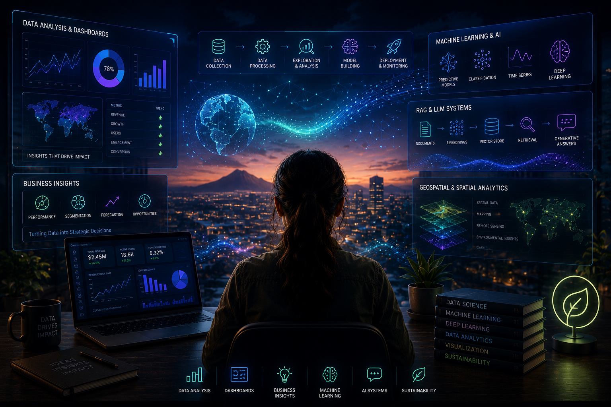

<!-- ============================================================= -->
<!-- HEADER -->
<!-- ============================================================= -->

  

<!-- ============================================================= -->
<!-- HERO INTRO -->
<!-- ============================================================= -->

  <h2>👋 Hello, I'm Mounusha</h2>

 

<table width="100%" style="border-collapse: collapse; border: none;">
  <tr>
    <td width="70%" valign="top" style="border: none;">
      <h3>👩‍💻 Professional Profile</h3>
      

        <b>Data Scientist &nbsp;•&nbsp; Machine Learning Researcher</b>  
        <i>Transforming raw data into sustainable, actionable intelligence using Machine Learning, Geospatial Analysis, and Generative AI.</i>
      

      

      

        🎓 <b>MS Data Science @ Arizona State University</b> (Dec 2026) - 4.0 GPA 
        🔬 <b>Data Science Researcher</b> @ ASU 
        💡 <b>Building:</b> 15+ ML Systems & Video RAG Architectures
      

    </td>
    <td width="30%" valign="top" align="center" style="border: none;">
      <h3>🚀 Availability Phase</h3>
       
      
        
      
        
      
    </td>
  </tr>
</table>

 

  &nbsp;
  &nbsp;
  &nbsp;
  &nbsp;
  

---

<!-- ============================================================= -->
<!-- CURRENTLY -->
<!-- ============================================================= -->

<h2 align="center">🚀 Currently</h2>

| Track | Status |
|---|---|
| 🔨 Building | Video RAG for semantic search and context-aware Q&amp;A over video content |
| 📖 Learning | Agentic AI workflows, MLOps practices, production-grade evaluation |
| 💼 Internship / Co-op | 🟢 Available immediately |
| 🎯 Full-time | 🟡 Available December 2026 |

---

<!-- ============================================================= -->
<!-- LANGUAGES & TOOLS -->
<!-- ============================================================= -->

<h2 align="center">🧠 Languages &amp; Tools</h2>

<table>
<tr>
<td width="50%" valign="top">

**Data Science &amp; Machine Learning**

</td>
<td width="50%" valign="top">

**Data Analytics &amp; Visualization**

</td>
</tr>
<tr>
<td width="50%" valign="top">

**Data Engineering &amp; Infrastructure**

</td>
<td width="50%" valign="top">

**Cloud &amp; Full Stack**

</td>
</tr>
<tr>
<td width="50%" valign="top">

**Development Tools &amp; Automation**

</td>
<td width="50%" valign="top">

**Sustainability &amp; Environmental**

</td>
</tr>
</table>

---

<!-- ============================================================= -->
<!-- FEATURED PROJECTS -->
<!-- ============================================================= -->

<h2 align="center">🗂️ Featured Projects</h2>

<table>
  <tr>
    <td width="50%" valign="top">
      <h3>🛒 GenAI Retail Forecast &nbsp;<code>✅ Active</code></h3>
      
Production-grade ML system that ingests raw retail sales, trains time-series forecasting models on BigQuery ML, and delivers 30-day demand forecasts through a FastAPI backend and Streamlit BI dashboard.

      

        <b>Focus:</b> Time-Series · Retail Forecasting · Big Data ML 
        <b>Tech:</b> BigQuery ML · FastAPI · Streamlit · Python
      

      
    </td>
    <td width="50%" valign="top">
      <h3>🎙️ Aria VisionAI &nbsp;<code>✅ Complete</code></h3>
      
Accessibility-focused voice AI for blind/visually impaired users. Listens to voice, reasons about intent, and executes desktop/web actions (browsing, writing, coding) through natural spoken conversation.

      

        <b>Focus:</b> Voice AI · Accessibility · Multi-Modal LLMs 
        <b>Tech:</b> LLMs · NLP · Desktop APIs · Speech-to-Text
      

      
    </td>
  </tr>
  <tr>
    <td width="50%" valign="top">
      <h3>🍄 MyceliumAI &nbsp;<code>✅ Complete</code></h3>
      
A collaborative knowledge-sharing network for AI agents. Prevents wasted computation by enabling stuck, loop-bound agents to ask the collective network for help instead of failing repeatedly.

      

        <b>Focus:</b> Multi-Agent Systems · Knowledge Graphs · GenAI 
        <b>Tech:</b> Python · Agentic Workflows · Distributed Computing
      

      
    </td>
    <td width="50%" valign="top">
      <h3>🛵 Swiggy Strategy Analysis &nbsp;<code>✅ Complete</code></h3>
      
Full-stack Swiggy sales analytics over 197,430 Indian food delivery orders. Developed three original strategic frameworks: City Expansion Index, Menu Intelligence Matrix, and Restaurant Health Score.

      

        <b>Focus:</b> Data Analytics · Business Strategy · ETL 
        <b>Tech:</b> SQL · Pandas · Tableau · Data Engineering
      

      
    </td>
  </tr>
</table>

---

<!-- ============================================================= -->
<!-- EXTRACURRICULARS, CERTIFICATIONS & CONFERENCES -->
<!-- ============================================================= -->

<h2 align="center">🌟 Extracurriculars &amp; Certifications</h2>

<table width="100%">
  <tr>
    <td width="33%" valign="top">
      <h3>✊🏼 Leadership &amp; Service</h3>
       
      <ul style="list-style-type: none; padding-left: 0; line-height: 2.0;">
        <li></li>
        <li></li>
        <li></li>
      </ul>
    </td>
    <td width="33%" valign="top">
      <h3>📜 Professional Accolades</h3>
       
      

         
         
        <b>Deep Learning Specialization</b> 
        <small><i>DeepLearning.AI</i></small> 
        
        
        
         
        <small><i>Optimization for real-world AI systems</i></small>
      

    </td>
    <td width="33%" valign="top">
      <h3>🎙️ Tech Conferences</h3>
       
      

          
          
          
        
      

    </td>
  </tr>
</table>

---

<!-- ============================================================= -->
<!-- GITHUB ACTIVITY -->
<!-- ============================================================= -->

<h2 align="center">📈 GitHub Activity</h2>

 

  

<picture>
  <source media="(prefers-color-scheme: dark)" srcset="https://raw.githubusercontent.com/Mounusha25/Mounusha25/output/github-contribution-grid-snake-dark.svg" />
  <source media="(prefers-color-scheme: light)" srcset="https://raw.githubusercontent.com/Mounusha25/Mounusha25/output/github-contribution-grid-snake.svg" />
  
</picture>

---

  <i>"Let's connect if you're building at the intersection of <b>data, AI, and sustainability</b>." 🌍</i> 
  <i>Always open to collaborating on projects that <b>matter</b>.</i>

